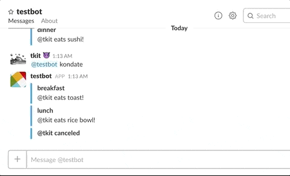

Errbot example plugin "KONDATE"
====

This plugin is DEMONSTRATION for [Slack Interactive Messages](https://api.slack.com/interactive-messages).



# how to use

1. start a docker container

```
docker run --rm \
    --name err \
    -e BACKEND=Text \
    -e BOT_USERNAME="@testbot" \
    -e BOT_ADMINS="@tkit" \
    -e BACKEND=Slack \
    -e BOT_TOKEN=<your_bot_token> \
    -e "TZ=Asia/Tokyo" \
    -e SLACK_VERIFICATION_TOKEN=<your_slack_verification_token> \
    -p 3141:3141 -p 3142:3142 \
    rroemhild/errbot
```

`BOT_TOKEN` and `SLACK_VERIFICATION_TOKEN` are written in bot information page of Slack.

image : [rroemhild/errbot](https://hub.docker.com/r/rroemhild/errbot/)

2. install this plugin

```
!repos install https://github.com/tkit/errbot-plugin-example-kondate
```

3. play

type `@testbot kondate`.

